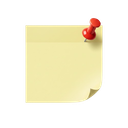
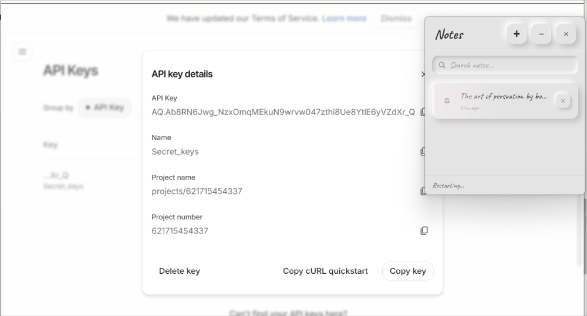
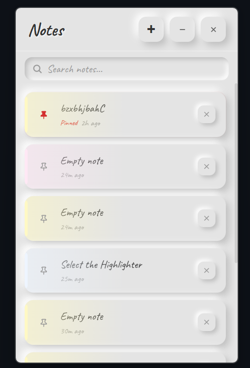
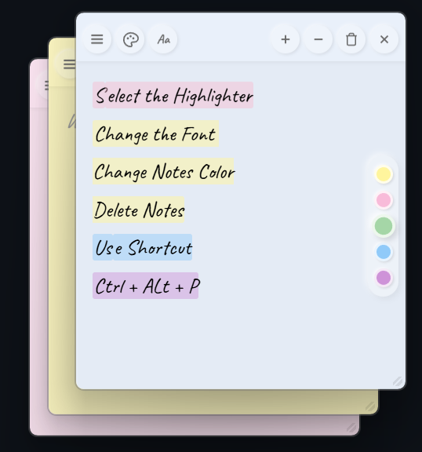

<div align="center">



# PinNotes

**Floating sticky notes for Windows & macOS**

Pin notes to your desktop — always on top, always within reach.

[](https://github.com/AleenaTahir1/Pin-Notes/releases)
[](https://github.com/AleenaTahir1/Pin-Notes/actions)
[](LICENSE.txt)

<br/>



</div>

---

## Screenshots

### Notes List

<p align="center">
  
</p>

### Note Window

<p align="center">
  
</p>

---

## Why PinNotes

You have thoughts, tasks, and quick reminders scattered across apps, browser tabs, and text files. Nothing stays visible. Nothing stays handy.

PinNotes gives you floating sticky notes that pin to your desktop — always on top of other windows. Jot something down, pick a color, and it stays right where you need it. No accounts, no cloud, no clutter.

---

## Features

- **Always on top** — Floating notes that stay visible over all other windows
- **Obsidian sync** — Two-way sync with an Obsidian vault: edit notes in either app
- **Markdown formatting** — Headings (H1–H6), **bold**, *italic*, ~~strikethrough~~, `inline code`, blockquotes, bullet lists, and tickable task checkboxes (`- [ ]` or `-[ ]`) — all round-trip with Obsidian
- **Preview mode** — Markdown/template notes get an eye toggle to flip between editing and a clean, read-only rendered view
- **Templates** — Start notes from 9 built-in templates, or your own templates from your Obsidian vault
- **Dark mode** — Pastel-tinted dark theme with one-click toggle, synced across all notes
- **Notes list panel** — Browse, search, and pin-to-top your favorite notes
- **Highlighting** — Select text to pop up a color strip (5 colors) with an eraser to remove a highlight
- **Multiple note colors** — 8 pastel themes to color-code your notes
- **Font & text size** — Switch fonts (Handwriting, Clean, Mono) and step text size up/down — each note remembers both
- **Freeform sizing** — Drag any corner or edge to resize, all the way down to a thin one-line note; each note reopens at the size you left it
- **System tray** — Quick actions from the tray icon (new note, notes list, show all, quit)
- **Global shortcuts** — Create notes and open the list from anywhere on your desktop
- **Auto-save** — Notes save automatically with debounce, no manual saving needed
- **Local storage** — JSON file persistence — no cloud, no account required
- **Frameless windows** — Draggable, borderless windows that feel like real sticky notes
- **Neumorphic design** — Soft, modern UI with subtle depth and shadows

---

## Installation

Download the latest release from the [Releases](https://github.com/AleenaTahir1/Pin-Notes/releases) page:

- **Windows** — `.exe` (NSIS installer). Installs in place and supports auto-updates.
- **macOS** — `.dmg` (Apple Silicon & Intel). The build is unsigned, so on first launch
  **right-click the app → Open** (or allow it under System Settings → Privacy & Security).

---

## Usage

### Quick Start

1. **Launch PinNotes** — The app starts in the system tray
2. **Create a note** — Press `Ctrl+Alt+P` or right-click the tray icon
3. **Write anything** — Your note auto-saves as you type
4. **Pick a color** — Click the palette icon to change note color
5. **Highlight text** — Select text and a color strip pops up; pick a color (or the eraser to remove one)

### Keyboard Shortcuts

| Shortcut | Action |
|----------|--------|
| **Ctrl+Alt+P** | Create a new note |
| **Ctrl+Alt+L** | Open notes list |

### System Tray

Right-click the tray icon for quick actions:

| Action | Description |
|--------|-------------|
| **New Note** | Create a new sticky note |
| **Notes List** | Open the notes list panel |
| **Show All** | Bring all notes to the front |
| **Quit** | Close PinNotes |

### Dark Mode

Click the **sun/moon** icon in the notes-list header to toggle dark mode. Your choice is saved and applies to every open note instantly. In dark mode each note keeps its color as a tint, so a Buttercream note reads as warm dark grey and a Sky note as a cool anthracite.

### Formatting (Markdown)

Notes understand plain Markdown, so anything you write stays readable in Obsidian and vice-versa:

| Type this | Get |
|-----------|-----|
| `# Heading` … `###### Heading` | Headings H1–H6 |
| `**bold**` | **bold** |
| `*italic*` or `_italic_` | *italic* |
| `~~strike~~` | ~~strikethrough~~ |
| `` `code` `` | `inline code` |
| `> quote` | Blockquote |
| `- item` | Bullet list |
| `- [ ] task` / `-[ ] task` / `- [x] done` | Checkbox (click the box in the note to tick it off) |

Markdown renders when you reopen a note, or instantly via the **👁 Preview** toggle (it appears on the titlebar for any note containing markdown — flip between editing and a clean rendered view).

**Highlights:** select text and a small color strip pops up above it — pick one of 5 colors, or the eraser to remove a highlight. Stored as `==highlights==` for Obsidian. Use the **A− / A+** buttons on a note's titlebar to change its text size and the **Aa** button to change its font — each note remembers both.

### Templates

Skip the blank page — start a note from a template.

1. Open the **notes list** and click the **+** button.
2. Pick **Blank**, or one of the **9 built-in templates** (To-do list, Daily note, Meeting notes, Project plan, Habit tracker, Book notes, Pros & cons, Grocery list, Quick bullets).
3. The note opens pre-filled. `{{date}}` and `{{time}}` are replaced with the current date/time automatically.

**Your own templates (from Obsidian):** once a vault is connected (see below), create a folder named **`Templates`** inside it and drop in any `.md` files. They show up under **"From your vault"** in the **+** menu — so you can reuse the exact note layouts you already keep in Obsidian. (No vault connected yet? The menu shows a link to connect one.)

### Obsidian Sync

Keep your notes in sync with an Obsidian vault — edit them in PinNotes **or** Obsidian.

1. Open the **notes list** and click the **link (chain)** icon in the header.
2. Pick a folder inside your vault (e.g. `YourVault\PinNotes`). The icon turns purple when sync is on.
3. That's it — edits flow both ways automatically. Each note becomes a `.md` file with front-matter; new `.md` files you add in Obsidian become notes.

**Custom templates:** add a `Templates` folder inside your vault and put `.md` files in it — they appear in PinNotes' **+** menu under "From your vault" (see [Templates](#templates) above).

To stop, click the **unlink** icon (your `.md` files are kept). Notes: conflicts resolve last-write-wins, and deleting is one-way (delete in PinNotes to remove a note for good). See [OBSIDIAN_INTEGRATION.md](OBSIDIAN_INTEGRATION.md) for details.

---

## Development

### Requirements

- Node.js 18+
- Rust 1.70+
- Tauri 2 system dependencies

### Run Locally

```bash
git clone https://github.com/AleenaTahir1/Pin-Notes.git
cd Pin-Notes
npm install
npm run tauri dev
```

### Build

```bash
npm run tauri build
```

### Project Structure

```
PinNotes/
├── src/                    # Frontend (React + TypeScript)
│   ├── components/         # UI components
│   │   ├── NoteWindow.tsx  # Individual sticky note
│   │   ├── NotesList.tsx   # Notes list panel
│   │   ├── NoteEditor.tsx  # Note content editor
│   │   ├── ColorPicker.tsx # Note color selection
│   │   ├── UpdateChecker.tsx      # Auto-update banner
│   │   └── DeleteModal.tsx # Delete confirmation
│   ├── hooks/              # Custom React hooks
│   ├── store/              # Zustand state management
│   ├── styles/             # CSS styles
│   └── types.ts            # Shared types and constants
├── src-tauri/              # Backend (Rust)
│   └── src/
│       ├── lib.rs          # App setup and plugin registration
│       ├── commands.rs     # Tauri IPC command handlers
│       ├── storage.rs      # JSON file persistence
│       ├── settings.rs     # Persisted settings (Obsidian vault path)
│       ├── sync.rs         # Two-way Obsidian (Markdown) sync engine
│       ├── window.rs       # Frameless window creation
│       ├── hotkey.rs       # Global shortcut registration
│       └── tray.rs         # System tray menu
└── package.json
```

---

## Tech Stack

- **Frontend** — React 19, TypeScript, Zustand
- **Backend** — Rust, Tauri 2
- **Animations** — Framer Motion
- **Markdown** — Two-way Obsidian sync (custom highlight syntax `==text==`)
- **UI Style** — Neumorphic design
- **Build** — Vite

---

## License

This project uses a **Source Available** license. See [LICENSE.txt](LICENSE.txt) for details.

- Free for personal and educational use
- Free to modify for personal use
- Commercial use requires permission

---

## Author

**Aleena Tahir**

- GitHub: [@AleenaTahir1](https://github.com/AleenaTahir1)
- LinkedIn: [aleenatahir](https://www.linkedin.com/in/aleenatahir/)
